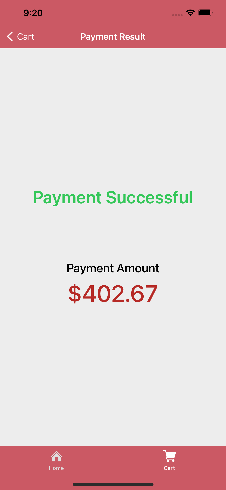

# Grocery App for iOS written in Swift

## :notebook_with_decorative_cover: Introduction 
Grocery app is a reference grocery app for Huawei Analytics Kit, Crash Service and Scan Kit. 
App written in swift for iOS devices. You can track users' visited pages with Analytics Kit and also can solve problems with Crash Service if any bug occures. 
At the end of shopping, to make a payment scan QR Code below for a successfull transaction. Of corse it is just a demo, don't wait for shipping :)

## :black_square_button: QR Codes
<table>
  <tr>
    <td width="50%" align="center">
      
    </td>
    <td width="50%" align="center">
      
    </td>
  </tr>
  <tr>
    <td width="50%" align="center">
      Scan this code for successfull payment.
    </td>
    <td width="50%" align="center">
      Scan this code for unsuccessfull payment.
    </td>
  </tr>
</table>

## :iphone: Screenshots
<table>
  <tr>
    <td width="33%">
      
    </td>
    <td width="33%">
      
    </td>
    <td width="33%">
      
    </td>
  </tr>
  <tr>
    <td width="33%">
      
    </td>
    <td width="33%">
      
    </td>
    <td width="33%">
      
    </td>
  </tr>
</table>

##  :question: Before You Start
* You need to import <b>agconnect-services.plist</b> file to run the project correctly.
* If you don't have a Huawei Developer account, check <a href="https://developer.huawei.com/consumer/en/doc/start/10104" target="_blank">this document</a> to create a new one.
* <a href="https://developer.huawei.com/consumer/en/console" target="_blank">Login</a> to Huawei Developer Console.
* If you don't have a project and app, check <a href="https://developer.huawei.com/consumer/en/doc/distribution/app/agc-create_app" target="_blank">this document</a> to learn how to create.
* Go to <b>My Projects</b> and select your project that you were created. And click <b>Project Settings</b> then go to <b>Manage APIs</b> page to nable necessary SDKs.
* For this project you have to set enable Analytics Kit. Select <b>Crash</b> page from left menu then enable it. Also go to <b>HUAWEI Analytics</b> -> <b>Project overview</b> to enable Analytics Kit.
* Then return to <b>Project Settings</b> page and download <b>agconnect-services.plist</b> file.
* Move the configuration file into your project, below Info.plist file.

##  :information_desk_person: Things to Know
* You must have a Huawei Developer account to create project and track analytics
* You need a Mac with Xcode 10.1 or later installed
* You need a device with iOS 9.0 or later
* You need Cocoapods to install libraries

## :milky_way: Features
* Every page trackable that users cliked by Analytics Kit
* Track users when they add an item into their chart
* Track users when they removed an item from their chart
* Track users when they click product details
* Detect any crash by Crash Service
* Make a payment by scanning qr code by Scan Kit

## :rocket: Kits
* [Huawei Analytics Kit](https://developer.huawei.com/consumer/en/doc/development/HMSCore-Guides/introduction-0000001050745149) ([Codelab](https://developer.huawei.com/consumer/en/codelab/HMSAnalyticsKit-iOS/index.html))
* [Huawei Crash Service](https://developer.huawei.com/consumer/en/doc/development/AppGallery-connect-Guides/agc-crash-introduction) ([Codelab](https://developer.huawei.com/consumer/en/codelab/CrashService-iOS/index.html))
* [Huawei Scan Kit](https://developer.huawei.com/consumer/en/doc/development/HMSCore-Guides/service-introduction-0000001050041994) ([Codelab](https://developer.huawei.com/consumer/en/codelab/ScanKit-iOS/index.html))

## :telescope: Future Features 
* Detecting products with ML Kit

## :link: Useful Links 
* [Huawei Developers Medium Page EN](https://medium.com/huawei-developers)
* [Huawei Developers Medium Page TR](https://medium.com/huawei-developers-tr) 
* [Huawei Developers Forum](https://forums.developer.huawei.com/forumPortal/en/home)
